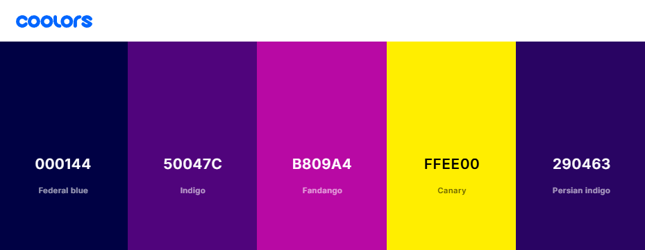
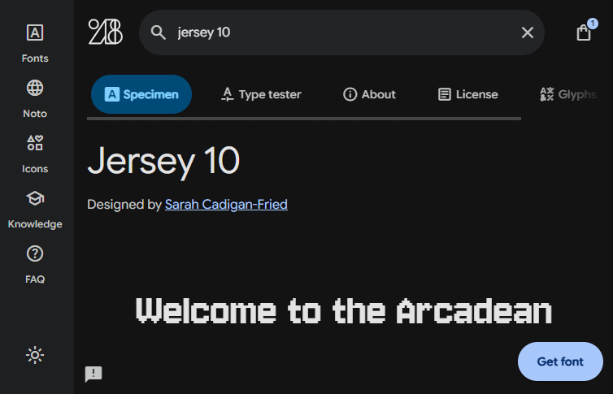
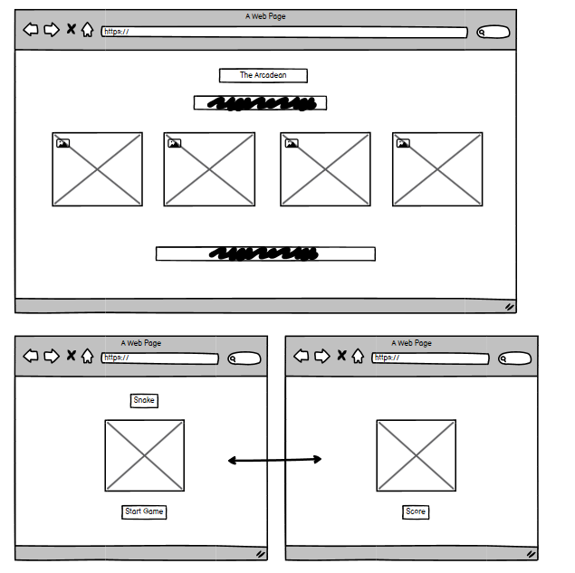
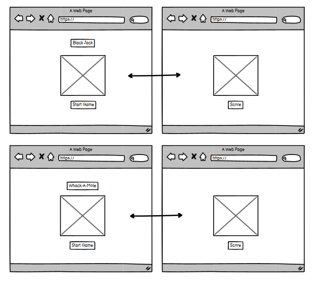
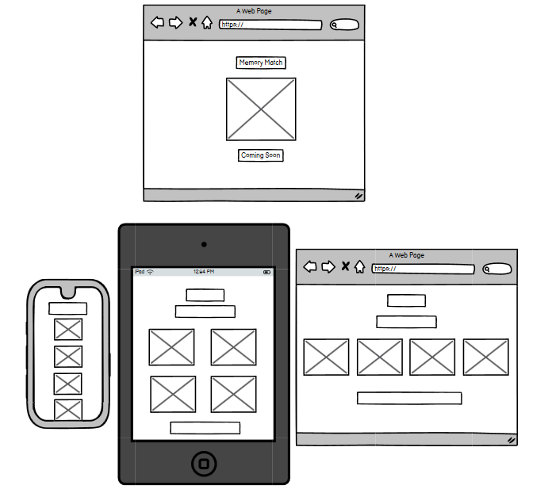
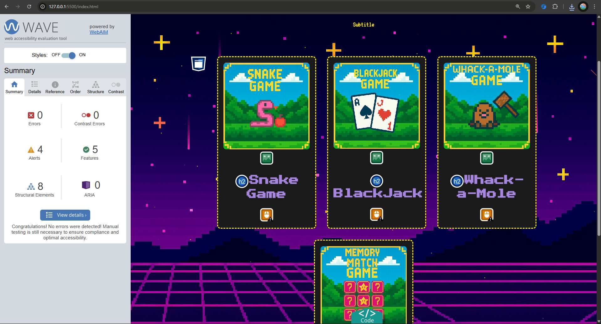
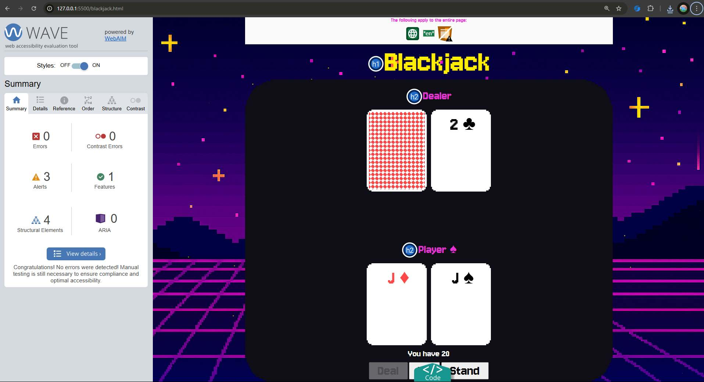
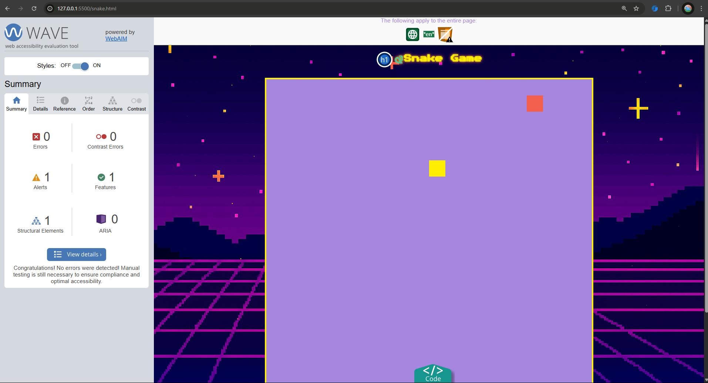
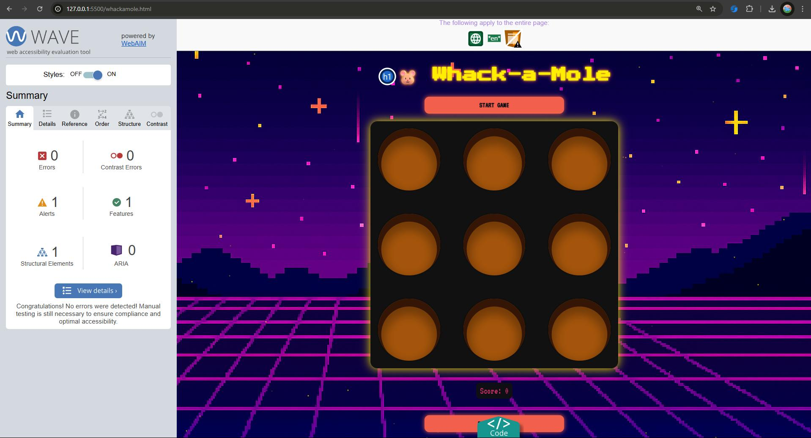

# Hackathon Pixels Arcade

# Introduction
The Arcadean is a collection of classic browser games built with HTML, CSS, and JavaScript. The site is designed to provide users with fun, interactive options to cure boredom, all within a visually consistent and easy-to-navigate interface. There is no backend functionality, everything runs client-side for instant play.

## [Link to Live Website](https://wen-l-liu.github.io/hackathon-pixels/)

## Table of Contents
- [Project Outline](#project-outline)
    - [Key Objectives](#key-objectives)
- [UX Design](#ux-design)
    - [User Stories](#user-stories)
    - [Colour Palette](#colour-palette)
    - [Wireframes](#wireframes)
    - [Fonts](#fonts)
- [Features](#features)
- [Deployment / Dependencies](#deployment--dependencies)
- [Accounts](#accounts)
- [AI Implementation](#ai-implementation)
- [Testing and Validation](#testing-and-validation)
    - [HTML Validation](#html-validation)
    - [CSS Validation](#css-validation)
    - [JavaScript Validation](#javascript-validation)
- [Technology](#technology)
- [References](#references)
- [External Resource Links](#external-resource-links)
- [Credits](#credits)

---

## Project Outline
This project aims to deliver a simple, accessible arcade of mini-games for users seeking entertainment. Each game is implemented as a single-page app, with a shared theme and navigation for a seamless experience. The site is fully responsive and accessible, ensuring playability across devices.

### Key Objectives
- Provide a selection of classic games (Memory Match, Snake, Blackjack, Whack-a-Mole) in one place.
- Ensure a consistent visual theme and navigation across all games.
- Make the site fully responsive and accessible.
- Use only HTML, CSS, and JavaScript-no backend required.
- Optimize for fast loading and smooth gameplay.

## UX Design

### User Stories

- As a user, I want to access multiple games from a single homepage so I can easily choose what to play.
- As a user, I want each game to be visually consistent and easy to understand.
- As a user, I want the site to work well on both desktop and mobile devices.
- As a user, I want to see my score or progress in each game.
- As a user, I want to return to the arcade menu from any game.

### Colour Palette

A playful, retro-inspired palette was chosen to evoke classic arcade vibes while maintaining readability and accessibility.

### Fonts

- **Main Font:** Jersey 10 (Google Fonts) for a pixel-art, arcade feel.
- **Fallback:** Arial, sans-serif for compatibility.

### Wireframes

Wireframes show a simple homepage with game cards, and individual game layouts with clear navigation and score displays.

Click to expand Wireframes

Wireframe showing responsive mobile layouts.

## Features

- **Arcade Menu:** Homepage listing all available games with preview images and descriptions.
- **Consistent Theme:** Shared color scheme, fonts, and navigation across all pages.
- **Responsive Design:** Works on all screen sizes.
- **Individual Games:** 
    - Memory Card Match
    - Snake
    - Blackjack
    - Whack-a-Mole
- **Back to Menu:** Easy navigation to return to the arcade homepage.
- **Lightweight:** No login or backend required.

## Deployment / Dependencies

### Deployment
The site is deployed using [GitHub Pages](https://pages.github.com/), serving static files directly from the repository.

To deploy updates:
1. Commit and push changes to the `main` branch.
2. GitHub Pages automatically rebuilds and serves the latest version.

### Dependencies
- [Google Fonts](https://fonts.google.com/) for custom typography.
- [Font Awesome](https://fontawesome.com) for icons (if used).
- No build tools or package managers required; all dependencies are loaded via CDN.

## Accounts
- A GitHub account is required to deploy and manage the project repository.
- Optional: Font Awesome account for custom icon kits.

## AI Implementation

- GitHub Copilot was used for code suggestions, troubleshooting, and optimizing JavaScript logic.
- Assisted in debugging DOM manipulation and event handling in games.
- Provided ideas for user stories, acceptance criteria, and documentation structure.
- Helped ensure code followed best practices and accessibility guidelines.

## Technology

### Built with:
- **HTML5:** For structuring content.
- **CSS3:** For styling and responsive layout.
- **JavaScript:** For game logic and interactivity.
- **Git & GitHub:** For version control and deployment.
- **GitHub Copilot:** For coding assistance and debugging.

## Testing and Validation

### HTML Validation
- [W3C Markup Validation Service](https://validator.w3.org/) used to check for syntax errors and standards compliance.

### CSS Validation
- [W3C CSS Validation Service](https://jigsaw.w3.org/css-validator/) used to ensure valid CSS.

### JavaScript Validation
- [jshint](https://jshint.com/) used to check for code quality and errors.

### Wave-tool Validation
Wave-tool Validation is an accessibility evaluation tool that analyses web pages for accessibility issues.
It checks for problems such as missing alt text, low color contrast, improper heading structure, and other barriers that may affect users with disabilities.The tool helps to improve the accessibility and usability of the website.

Black Jack Page

Snake Page

Whack-a-mole

Code was validated and updated to resolve contrast issues found.

## References
- [MDN Web Docs](https://developer.mozilla.org/) for HTML, CSS, and JavaScript documentation.
- [Google Fonts](https://fonts.google.com/) for typography.
- [Font Awesome](https://fontawesome.com/) for icons.

## External Resource Links
- [squoosh.app](https://squoosh.app/) for image size reduction and optimization.
- [flaticon](https://www.flaticon.com/) for game icons in png file.

## Credits
- **Wireframes:** Created with [Balsamiq](https://balsamiq.com/).
- **Inspiration:** Classic arcade games and open-source browser game tutorials.
- **AI Assistance:** Code and documentation suggestions generated with GitHub Copilot.
- **Coded By: Wen Liu, Shafina Chowdhury, Zaenb AL Jiryen**
